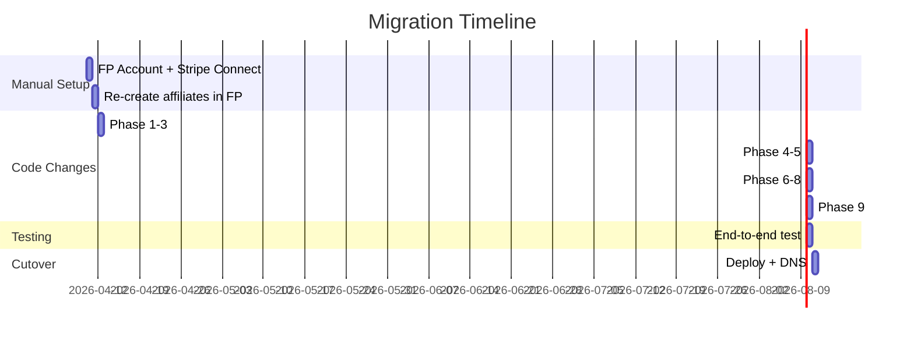

# Rewardful → FirstPromoter Migration

## Goal

Migrate the Positives affiliate program from Rewardful to FirstPromoter to enable 2-tier commissions (20% direct / 10% override), gain built-in W-9/tax form collection, and consolidate affiliate management on a more capable platform.

## Cost Impact

| Item | Current (Rewardful) | Proposed (FirstPromoter) |
|---|---|---|
| Monthly cost | ~$75/mo (Growth plan) | $99/mo (Business plan) |
| 2-tier support | ❌ Not available | ✅ Native |
| W-9 collection | ❌ Custom-built | ✅ Built-in |
| Tax form filing (1099) | ❌ Manual | ⚠️ Via Tax1099 integration or manual |
| QuickBooks integration | ❌ None | ⚠️ CSV export (same as current) |

> [!IMPORTANT]
> FirstPromoter Business plan is $99/mo but replaces both Rewardful ($75/mo) AND the need for our custom W-9 infrastructure. Net cost increase is ~$24/mo for significantly more capability.

---

## User Review Required

> [!WARNING]
> **Manual step before code work begins:** You must create a FirstPromoter account at [firstpromoter.com](https://firstpromoter.com), connect your Stripe account, and retrieve your API key and Campaign ID. This cannot be automated.

> [!IMPORTANT]
> **Existing affiliates must be migrated manually.** Rewardful does not offer a bulk export API for referral history. Current affiliates (~4 accounts) will need to be re-created in FirstPromoter. Their historical commission data stays in Rewardful's dashboard for reference but won't carry over.

> [!CAUTION]
> **Affiliate links will change format.** Rewardful uses `?via=token`. FirstPromoter uses `?fpr=token` (or a custom parameter). All existing affiliate links shared by your promoters will stop tracking once the migration completes. We will set up 301 redirects for the old `?via=` format during transition.

---

## Current Rewardful Integration Surface — Full Audit

### 25 files touch Rewardful in some way:

| Layer | File | What it does |
|---|---|---|
| **API Client** | [client.ts](file:///Users/ryanbradshaw/AntiGravity/positives-membership/lib/rewardful/client.ts) | All Rewardful API calls: CRUD affiliates, commissions, payouts, SSO, slug updates |
| **Types** | [rewardful.d.ts](file:///Users/ryanbradshaw/AntiGravity/positives-membership/types/rewardful.d.ts) | `window.Rewardful` and `window.rewardful` type declarations |
| **JS Tracker** | [RewardfulTracker.tsx](file:///Users/ryanbradshaw/AntiGravity/positives-membership/components/RewardfulTracker.tsx) | Loads `r.wdfl.co/rw.js` script in root layout |
| **Root Layout** | [layout.tsx](file:///Users/ryanbradshaw/AntiGravity/positives-membership/app/layout.tsx) | Renders `<RewardfulTracker />` on every page |
| **Checkout (PricingCard)** | [PricingCard.tsx](file:///Users/ryanbradshaw/AntiGravity/positives-membership/components/marketing/PricingCard.tsx) | Reads `Rewardful.referral` → hidden form input → Stripe `client_reference_id` |
| **Checkout (actions)** | [join/actions.ts](file:///Users/ryanbradshaw/AntiGravity/positives-membership/app/join/actions.ts) | Passes `referralId` to `createGuestCheckoutSession` |
| **Checkout (service)** | [create-guest-checkout.ts](file:///Users/ryanbradshaw/AntiGravity/positives-membership/server/services/stripe/create-guest-checkout.ts) | Sets `client_reference_id` on Stripe session for Rewardful attribution |
| **Webhook** | [handle-checkout.ts](file:///Users/ryanbradshaw/AntiGravity/positives-membership/server/services/stripe/handle-checkout.ts) | Reads `client_reference_id` → stores as `rewardful_referral_id` on member |
| **Account Page** | [account/page.tsx](file:///Users/ryanbradshaw/AntiGravity/positives-membership/app/(member)/account/page.tsx) | Reads `rewardful_affiliate_token` + `rewardful_affiliate_id` for ReferralCard |
| **Affiliate Page** | [affiliate/page.tsx](file:///Users/ryanbradshaw/AntiGravity/positives-membership/app/(member)/account/affiliate/page.tsx) | Fetches affiliate data, commissions, payouts from Rewardful API |
| **Affiliate Actions** | [affiliate/actions.ts](file:///Users/ryanbradshaw/AntiGravity/positives-membership/app/account/affiliate/actions.ts) | `getReferralLinkAction`, `savePayPalEmailAction`, `updateReferralSlugAction`, `saveW9Action` |
| **Affiliate SSO** | [portal/route.ts](file:///Users/ryanbradshaw/AntiGravity/positives-membership/app/account/affiliate/portal/route.ts) | Generates Rewardful SSO magic link for dashboard access |
| **Affiliate Portal UI** | [AffiliatePortal.tsx](file:///Users/ryanbradshaw/AntiGravity/positives-membership/components/affiliate/AffiliatePortal.tsx) | Full affiliate dashboard: stats, commissions, payouts, W-9, slug editor |
| **Referral Card** | [ReferralCard.tsx](file:///Users/ryanbradshaw/AntiGravity/positives-membership/components/account/ReferralCard.tsx) | "Get my referral link" CTA + copy button + portal button |
| **Short Link Redirect** | [/go/[code]/route.ts](file:///Users/ryanbradshaw/AntiGravity/positives-membership/app/go/[code]/route.ts) | Appends `?via=TOKEN` to destination URLs |
| **Cookie Setter** | [/c/[code]/page.tsx](file:///Users/ryanbradshaw/AntiGravity/positives-membership/app/c/[code]/page.tsx) + [CookieSetter.tsx](file:///Users/ryanbradshaw/AntiGravity/positives-membership/app/c/[code]/CookieSetter.tsx) | Waits for Rewardful JS to set tracking cookie on external redirect |
| **AC Sync** | [sync.ts](file:///Users/ryanbradshaw/AntiGravity/positives-membership/lib/activecampaign/sync.ts) | `syncAffiliate()` — applies tag, sets custom fields with Rewardful data |
| **Env Config** | [.env.example](file:///Users/ryanbradshaw/AntiGravity/positives-membership/.env.example) | `REWARDFUL_API_KEY`, `REWARDFUL_API_SECRET` |
| **Supabase Types** | [types/supabase.ts](file:///Users/ryanbradshaw/AntiGravity/positives-membership/lib/supabase/types.ts) | References `rewardful_*` columns |

### Database Columns (on `public.member`)

| Column | Purpose |
|---|---|
| `rewardful_referral_id` | Stores Rewardful referral UUID from Stripe `client_reference_id` |
| `rewardful_affiliate_token` | Cached referral token (e.g. "ryan") for link generation |
| `rewardful_affiliate_id` | Cached Rewardful affiliate UUID for API calls |

### Database Table

| Table | Purpose |
|---|---|
| `affiliate_link` | Custom short links with `token` column (Rewardful affiliate token) |

---

## Proposed Changes

### Phase 0: FirstPromoter Account Setup (Manual — You)

Before any code changes:

1. **Sign up** at [firstpromoter.com](https://firstpromoter.com) — Business plan ($99/mo)
2. **Connect Stripe** via Settings → Integrations → Stripe
3. **Create campaign** "Positives Affiliate Program"
   - Tier 1: 20% recurring commission
   - Tier 2 (override): 10% of Tier 1 commission (recurring)
4. **Copy your API key** from Settings → Integrations → API
5. **Copy your website ID** (the `cid` value for `fpr.js`)
6. **Re-create existing affiliates** manually (~4 accounts) — match email addresses
7. **Enable W-9 collection** in Settings → Tax Forms (this replaces our custom W-9 form)

Deliver API key and website ID to me → I set them in `.env`.

---

### Phase 1: New FirstPromoter Client Library

#### [NEW] [client.ts](file:///Users/ryanbradshaw/AntiGravity/positives-membership/lib/firstpromoter/client.ts)

Drop-in replacement for `lib/rewardful/client.ts`. Same exported function signatures, different API underneath:

- `ensurePromoter()` — `POST /api/v1/promoters/create` (idempotent by email)
- `getPromoter()` — `GET /api/v1/promoters/show`
- `listPromoterCommissions()` — via promoter show response (includes rewards)
- `listPromoterPayouts()` — via promoter show response
- `updatePromoterPayPal()` — `PUT /api/v1/promoters/update`
- `updatePromoterRefId()` — custom ref_id/slug update
- `generateSlugFromName()` — pure function, unchanged

**Key API differences from Rewardful:**
- Auth: `X-API-KEY` header (not Basic auth)
- Content-Type: JSON (not URL-encoded)
- Promoters have a `ref_id` (equivalent to Rewardful's token) auto-generated from email
- No explicit SSO endpoint — FP has a built-in promoter dashboard at a configurable subdomain

---

### Phase 2: Tracking Script Swap

#### [MODIFY] [RewardfulTracker.tsx](file:///Users/ryanbradshaw/AntiGravity/positives-membership/components/RewardfulTracker.tsx) → **Rename to** [FirstPromoterTracker.tsx](file:///Users/ryanbradshaw/AntiGravity/positives-membership/components/FirstPromoterTracker.tsx)

Replace:
```diff
-  (function(w,r){w._rwq=r;w[r]=w[r]||...})(window,'rewardful');
-  <Script src="https://r.wdfl.co/rw.js" data-rewardful="6e2909" />
+  (function(w,d,s,o,f,js,fjs){
+    w['FirstPromoter']=o;w[o]=w[o]||function(){(w[o].q=w[o].q||[]).push(arguments)};
+    js=d.createElement(s),fjs=d.getElementsByTagName(s)[0];
+    js.id=o;js.src=f;js.async=1;fjs.parentNode.insertBefore(js,fjs);
+  })(window,document,'script','fpr','https://cdn.firstpromoter.com/fpr.js');
+  fpr('init', { cid: process.env.NEXT_PUBLIC_FIRSTPROMOTER_CID });
```

#### [MODIFY] [rewardful.d.ts](file:///Users/ryanbradshaw/AntiGravity/positives-membership/types/rewardful.d.ts) → **Rename to** [firstpromoter.d.ts](file:///Users/ryanbradshaw/AntiGravity/positives-membership/types/firstpromoter.d.ts)

Update `window.fpr` and `window.FirstPromoter` type declarations.

#### [MODIFY] [layout.tsx](file:///Users/ryanbradshaw/AntiGravity/positives-membership/app/layout.tsx)

```diff
- import { RewardfulTracker } from "@/components/RewardfulTracker";
+ import { FirstPromoterTracker } from "@/components/FirstPromoterTracker";
    ...
-   <RewardfulTracker />
+   <FirstPromoterTracker />
```

---

### Phase 3: Checkout Attribution

#### [MODIFY] [PricingCard.tsx](file:///Users/ryanbradshaw/AntiGravity/positives-membership/components/marketing/PricingCard.tsx)

FirstPromoter uses a cookie (`fprom_tid`) instead of a JS-accessible `Rewardful.referral` UUID. Because FP connects directly to Stripe via its own webhook listener, we actually **don't need to pass anything to Stripe anymore** — FP matches the Stripe customer to the promoter automatically via the tracking cookie.

```diff
-  // Read Rewardful.referral UUID
-  const [referral, setReferral] = useState<string | null>(null);
-  useEffect(() => { ... window.rewardful('ready', ...) }, []);
-  ...
-  {referral && <input type="hidden" name="referral" value={referral} />}
+  // FirstPromoter attribution happens automatically via FP's Stripe integration.
+  // No client-side referral ID injection needed.
```

#### [MODIFY] [join/actions.ts](file:///Users/ryanbradshaw/AntiGravity/positives-membership/app/join/actions.ts)

```diff
-  const referralId = (formData.get("referral") as string | null)?.trim() || null;
-  if (referralId) { console.log(...) }
-  const { url } = await createGuestCheckoutSession(priceId, referralId);
+  const { url } = await createGuestCheckoutSession(priceId);
```

#### [MODIFY] [create-guest-checkout.ts](file:///Users/ryanbradshaw/AntiGravity/positives-membership/server/services/stripe/create-guest-checkout.ts)

- Remove `referralId` parameter
- Remove `client_reference_id` logic
- Simplify: always set `metadata: { guest: "true" }`

#### [MODIFY] [handle-checkout.ts](file:///Users/ryanbradshaw/AntiGravity/positives-membership/server/services/stripe/handle-checkout.ts)

- Remove `rewardfulReferralId` extraction from `client_reference_id`
- Remove `rewardful_referral_id` from the member upsert
- Keep the rest of the checkout flow intact

---

### Phase 4: Affiliate Portal Rewrite

#### [MODIFY] [affiliate/page.tsx](file:///Users/ryanbradshaw/AntiGravity/positives-membership/app/(member)/account/affiliate/page.tsx)

- Replace Rewardful API calls with FirstPromoter API calls
- FP's `GET /api/v1/promoters/show?email=X` returns everything in one call (stats, commissions, sub-affiliates)
- Remove W-9 query (FP handles tax forms natively)
- Remove `w9Preview` logic

#### [MODIFY] [affiliate/actions.ts](file:///Users/ryanbradshaw/AntiGravity/positives-membership/app/account/affiliate/actions.ts)

- `getReferralLinkAction` → call `ensurePromoter()` instead of `ensureAffiliate()`
- `savePayPalEmailAction` → call FP's `updatePromoter()` instead of Rewardful
- `updateReferralSlugAction` → update FP's `ref_id` instead of Rewardful link token
- **`saveW9Action` → DELETE entirely** — FP's built-in tax form collection replaces this
- Cache `firstpromoter_id` + `firstpromoter_ref_id` on member row (replaces `rewardful_*` columns)

#### [MODIFY] [AffiliatePortal.tsx](file:///Users/ryanbradshaw/AntiGravity/positives-membership/components/affiliate/AffiliatePortal.tsx)

- Update all prop types from Rewardful shapes to FirstPromoter shapes
- **Remove the entire W9Form component** (~200 lines) — link to FP's tax form collection instead
- Add "Sub-Affiliates" section showing Tier 2 earnings
- Update portal link to FP's promoter dashboard URL (no SSO needed — FP has direct promoter login)

#### [DELETE] [portal/route.ts](file:///Users/ryanbradshaw/AntiGravity/positives-membership/app/account/affiliate/portal/route.ts)

Rewardful SSO endpoint — no longer needed. FP promoters access their dashboard directly at your configured subdomain.

---

### Phase 5: Short Links & Cookie Setter

#### [MODIFY] [/go/[code]/route.ts](file:///Users/ryanbradshaw/AntiGravity/positives-membership/app/go/[code]/route.ts)

```diff
-  internalUrl.searchParams.set("via", via);
+  internalUrl.searchParams.set("fpr", via);
```

#### [MODIFY] [/c/[code]/CookieSetter.tsx](file:///Users/ryanbradshaw/AntiGravity/positives-membership/app/c/[code]/CookieSetter.tsx)

- The 1.2s delay was for Rewardful's script to set a cookie. FP's `fpr.js` sets `fprom_tid` automatically on page load. Same pattern works — may adjust timing.

---

### Phase 6: Database Migration

#### [NEW] Migration: `rename_rewardful_to_firstpromoter_columns`

```sql
-- Rename columns to be platform-agnostic
ALTER TABLE public.member
  RENAME COLUMN rewardful_referral_id TO affiliate_referral_id;

ALTER TABLE public.member
  RENAME COLUMN rewardful_affiliate_token TO affiliate_ref_id;

ALTER TABLE public.member
  RENAME COLUMN rewardful_affiliate_id TO firstpromoter_id;

-- Update comments
COMMENT ON COLUMN public.member.affiliate_referral_id IS
  'FirstPromoter referral tracking ID. Set on join via affiliate link.';

COMMENT ON COLUMN public.member.affiliate_ref_id IS
  'FirstPromoter promoter ref_id (slug). Used for referral URL: positives.life?fpr={ref_id}.';

COMMENT ON COLUMN public.member.firstpromoter_id IS
  'FirstPromoter promoter ID. Used for API calls.';
```

> [!WARNING]
> The column renames will require updating every query that references the old column names. This is a breaking change — all files touching these columns must be updated simultaneously.

#### W-9 Table Decision

> [!IMPORTANT]
> **`member_w9` table can be preserved or dropped.**
> - If FirstPromoter's built-in W-9 collection is sufficient → drop the table and the related code
> - If we want a local backup of W-9 data → keep the table but stop writing to it from the UI
>
> **Recommendation:** Keep the table for now (it has 1 row), but stop populating it. If FP's tax form collection proves reliable over the next quarter, drop it in a cleanup pass.

---

### Phase 7: ActiveCampaign Sync Update

#### [MODIFY] [sync.ts](file:///Users/ryanbradshaw/AntiGravity/positives-membership/lib/activecampaign/sync.ts)

- `syncAffiliate()` — update custom field values to use new column names
- Change `FIELD.rewardfulLink` → `FIELD.affiliateLink`
- Change `FIELD.rewardfulToken` → `FIELD.affiliateRefId`
- Change `FIELD.rewardfulPortal` → update URL to FP promoter dashboard

---

### Phase 8: Environment Variables

#### [MODIFY] [.env.example](file:///Users/ryanbradshaw/AntiGravity/positives-membership/.env.example)

```diff
- # Rewardful (affiliate tracking)
- REWARDFUL_API_KEY=
- REWARDFUL_API_SECRET=
+ # FirstPromoter (affiliate tracking)
+ FIRSTPROMOTER_API_KEY=
+ NEXT_PUBLIC_FIRSTPROMOTER_CID=
```

---

### Phase 9: Cleanup

#### [DELETE] [lib/rewardful/client.ts](file:///Users/ryanbradshaw/AntiGravity/positives-membership/lib/rewardful/client.ts)
#### [DELETE] [components/RewardfulTracker.tsx](file:///Users/ryanbradshaw/AntiGravity/positives-membership/components/RewardfulTracker.tsx)
#### [DELETE] [types/rewardful.d.ts](file:///Users/ryanbradshaw/AntiGravity/positives-membership/types/rewardful.d.ts)

---

## W-9 Bugs — Resolution via Removal

The two W-9 bugs reported (Update button stuck, stale date display) are **resolved by removing the custom W-9 form entirely** and delegating to FirstPromoter's built-in tax form collection.

In the affiliate portal, the W-9 section becomes:

```
┌─────────────────────────────────────────────┐
│  📄 Tax Information                         │
│                                             │
│  The IRS requires a W-9 for affiliates      │
│  earning $600+ per calendar year.           │
│                                             │
│  [Complete W-9 via secure portal →]         │
│                                             │
│  Status: ✅ On file (signed Mar 15, 2026)   │
│  ── or ──                                   │
│  Status: ⚠️ Not yet submitted               │
└─────────────────────────────────────────────┘
```

The "Complete W-9" button links to the FP promoter dashboard's tax form section.

---

## Migration Sequence & Rollback Strategy



**Rollback plan:** If FP doesn't work out within 30 days:
- Rewardful code lives in git history (one `git revert` away)
- DB columns were renamed, not dropped — reversible migration
- Rewardful account stays active until we confirm FP is stable

---

## Open Questions

> [!IMPORTANT]
> 1. **Do you want to keep the custom short-link system (`/go/[code]`, `/c/[code]`)?** FirstPromoter has its own link management. We could simplify by removing our custom system entirely, or keep it as a "vanity URL" layer on top of FP.
>
> 2. **Affiliate communication plan:** How do you want to notify existing affiliates about the change? Email from AC? Personal message? They'll need to re-access their dashboard at a new URL.
>
> 3. **Timing:** Is this migration urgent, or should we batch it after the current sprint? The W-9 bugs are resolved either way (by removal), so the fix is immediate regardless.

---

## Verification Plan

### Automated Tests
1. **Tracking verification:** Visit site with `?fpr=test-ref`, confirm `fprom_tid` cookie is set
2. **Checkout test:** Complete a Stripe test-mode checkout with a test promoter link, verify FP records the conversion
3. **API test:** Call `ensurePromoter()`, verify promoter created in FP dashboard
4. **Portal test:** Navigate to `/account/affiliate`, verify stats/commissions load from FP API

### Manual Verification
1. **Affiliate flow:** Sign up as a new affiliate via `/account`, confirm link works
2. **2-tier test:** Affiliate A recruits Affiliate B, B refers Member C → verify A gets override commission in FP dashboard
3. **W-9 test:** Confirm FP's built-in tax form collection flow works for a test promoter
4. **Existing affiliates:** Confirm all re-created affiliates can access their new dashboard
